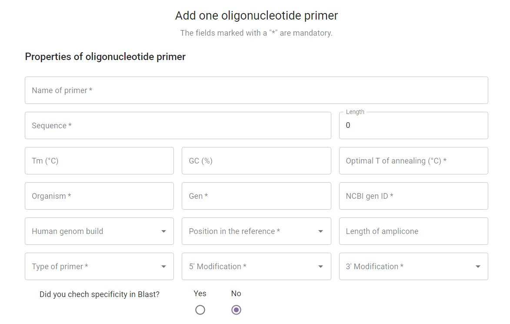

# Specifications of BioPrime

## A repository for keeping record of the primers in a Biobank

### First Introduction

The document describes the specifications of the repository BioPrime for computerisation of biobanks for primers. The respository is a system for organised management of informations about the primers, the existing stocks of primers in the laboratory and their location there. It will simplify the ordering and the recording of the consumption of primers. It will also provide a way better trasparency of the analyses of the companies and ease their everyday work.

Good documentation constitutes an essential part of the quality assurance system and is key to operating in compliance with GMP requirements, so with this document we provide you a description of the functions of the repository, instructions and procedures, written in an instructional form. The document contains:

* review of the repository with a use – case diagram
* detailed description of user access control
* functional requirements of individual parts of the repository
* user view, that represents the final appearance of the repository

### Review of the repository

#### Use - case diagram

### Users access

A new user is created by the Administrator, who also provides the username (or new users log in with an already existing email) and password. He also sets the user's role and their level of access.  As written before, different users will have different roles in the repository, which controls their information access. The roles are:

* Guest / General user
* Student
* Laboratory Technician
* Researcher / Lab Staff
* Administrator

#### Guest / General user

A Guest / General user will have the access to primer data (view only) and will be able to export data.

#### Student

A Student will have access to primer data (view only) and history view. They will be able to export data and modify primer volume.

#### Laboratory Technician

A Laboratory Technician will have access to primer data (view only) and history view. They will be able to import  (but not export), order new / reorder primers and modify primer volume and state (formulation).

#### Researcher / Lab Staff

A Researcher / Lab Staff will have access to primer data (view only) and history view. They will be able to import and also export data, to add or remove primers, modify primer data, volume and state (formulation) and order new / reorder primers.

#### Administrator

The Administrator will have access to primer data (view only) and history view. They will be able to import and also export data, to add or remove primers, modify primer data, volume and state (formulation) and order new primers / reorder primers. They will see the users overview and be able to add or remove users, modify  access level of users and modify their roles.

### System Functionality

We divided the system functionality into specific sections:

* Login Page
* Access to Primer Data Library
* Searching and Sorting Primer Data
* Adding New Primers
* Costumizing Primer Data
* Ordering New Primers
* Analysis

### Login Page

When you access the BioPrime website, it first takes you to the login options. All repository users need to log in before viewing or costumizing data.

New users and their assigned roles are created by the Administrator. Users are then notified by e-mail about their access grant. Personal or work e-mail can be used as the username and the password should be set by the users themselves.

If the password has been forgotten or the e-mail has been changed, the Administrator can permit the option of creating a new password, change the role of the user or delete them and add them with a new e-mail.

### Access to Primer Data Library

### Searching and Sorting Primer Data

### Adding New Primers

New primers are added with a click on the "Add" button on the top right. The system offers you to add one or two primers at the same time, or if you simply want to upload a document you can click CSV and upload your file on to the database.

### Costumizing Primer Data

### Ordering New Primers

### Analysis

| Urban | Urban |
|-------|-------|
| test  | test  |

-------------
