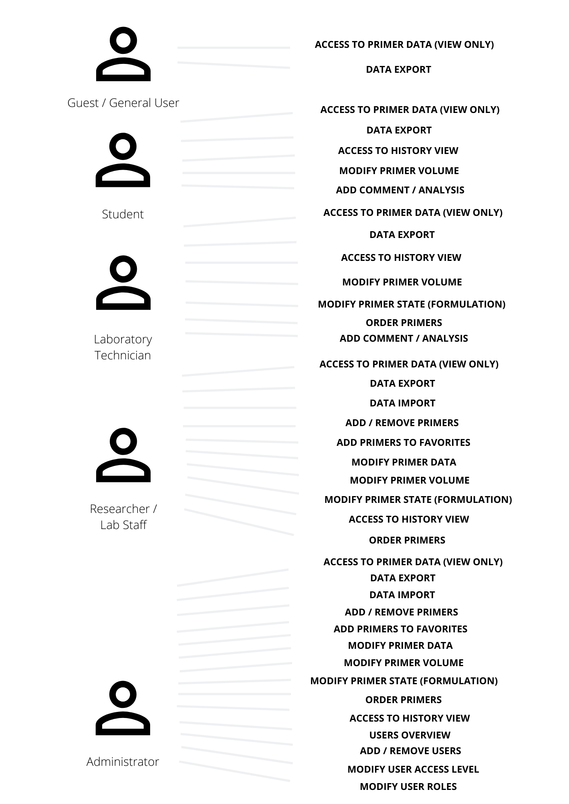
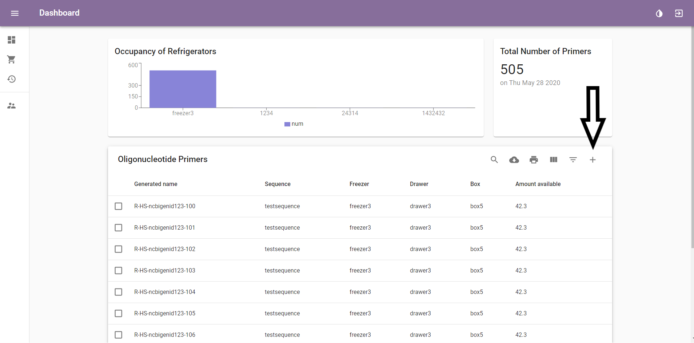
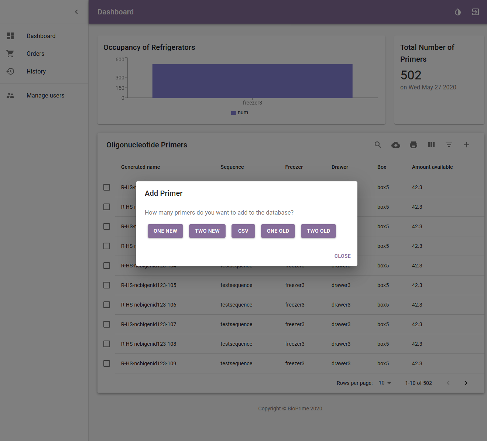
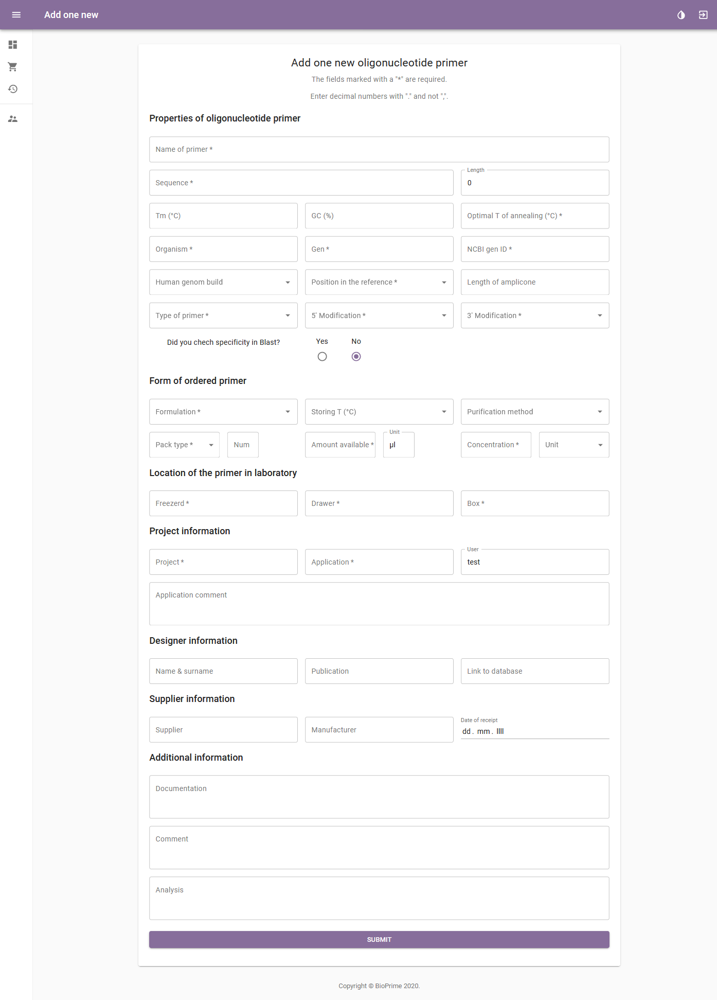
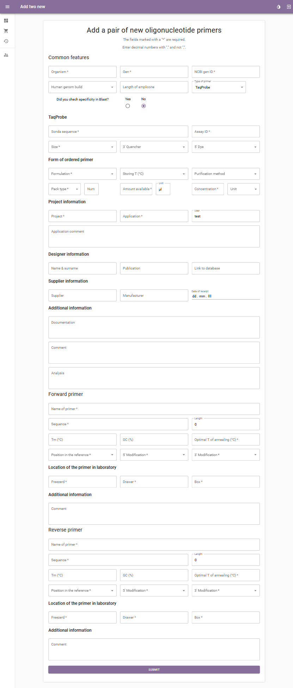


# Specifications of BioPrime

## A repository for keeping record of the primers in a Biobank

### First Introduction

The document describes the specifications of the repository BioPrime for computerisation of biobanks for primers. The respository is a system for organised management of informations about the primers, the existing stocks of primers in the laboratory and their location there. It will simplify the ordering and the recording of the consumption of primers. It will also provide a way better trasparency of the analyses of the companies and ease their everyday work.

Good documentation constitutes an essential part of the quality assurance system and is key to operating in compliance with GMP requirements, so with this document we provide you a description of the functions of the repository, instructions and procedures, written in an instructional form. The document contains:

* review of the repository with a use – case diagram
* detailed description of user access control
* functional requirements of individual parts of the repository (system functionality)
* user view, that represents the final appearance of the repository

### Review of the repository

#### Use - case diagram

### Users access

A new user is created by the Administrator, who also provides the username (or new users log in with an already existing email) and password. He also sets the user's role and their level of access.  As written before, different users will have different roles in the repository, which controls their information access. The roles are:

* Guest / General user
* Student
* Laboratory Technician
* Researcher / Lab Staff
* Administrator

#### Guest / General user

A Guest / General user will have the access to primer data (view only) and will be able to export data.

#### Student

A Student will have access to primer data (view only) and history view. They will be able to export data and modify primer volume.

#### Laboratory Technician

A Laboratory Technician will have access to primer data (view only) and history view. They will be able to import  (but not export), order new / reorder primers and modify primer volume and state (formulation).

#### Researcher / Lab Staff

A Researcher / Lab Staff will have access to primer data (view only) and history view. They will be able to import and also export data, to add or remove primers, modify primer data, volume and state (formulation) and order new / reorder primers.

#### Administrator

The Administrator will have access to primer data (view only) and history view. They will be able to import and also export data, to add or remove primers, modify primer data, volume and state (formulation) and order new primers / reorder primers. They will see the users overview and be able to add or remove users, modify  access level of users and modify their roles.

## System Functionality

We divided the system functionality into specific sections:

* Login Page
* Access to Primer Data Library
* Searching and Sorting Primer Data
* Adding New Primers
* Customizing Primer Data
* Ordering New Primers
* Analysis

## Login Page

When you access the BioPrime website, the page first offers you the login options. All repository users need to log in before viewing or customizing data.

New users and their assigned roles are created by the Administrator. Users are then notified by e-mail about their access grant. Personal or work e-mail can be used as the username and the password should be set by the users themselves.

If the password has been forgotten or the e-mail has been changed, the Administrator can permit the option of creating a new password, change the role of the user or delete and add them with a new e-mail.

## Access to Primer Data Library

After logging in, user is presented with the Dashboard, the main page of the program.

Icons on the left show (in a descending order):

* Dashboard, the main page showing primer data
* Orders, where recent and pending orders can be viewed
* History, which shows a timeline of all changes made by the users (view limited only to specific users)

The Administrator also has access to the "Manage Users" section.

Dashboard view shows general analysis data on top of the page, including the occupancy of refrigerators and the total number of primers.

Primers are presented in a list and are automatically sorted by their Generated name in a descending order. The order can be modified based on any trait (such as Sequence, Freezer, User etc.), described in detail in the Customizing primer data chapter.

Only the desired amount of primer data is shown, described in detail in the Searching and Sorting Primer Data section.

Details of each primer can be viewed by clicking the box on the left of each primer then choosing "Open Data" on the top right.

This way primers can also be modified or deleted, if your assigned role allows you that option. This is described in the Customizing primer data section.

## Searching and Sorting Primer Data

Search options include normal and advanced search options.
To access the search bar select the search icon and the bar will appear on the left. When using normal search, the user can search solely based on the gene.

Advanced search can be accessed by clicking on the "Filter Table" button on the top right,

Search under these traits is available:

* ID of primer
* Generated name of primer
* Organism
* User
* Type of primer
* Project
* Supplier
* Manufacturer
* Location (Freezer)

Primers can be sorted based on certain traits by clicking on the "View columns" button on the top right and checking off the boxes with desired traits, then clicking the name of the trait on top of each column to sort based on ascending order and double clicking for the descending order.

When checking off the boxes, the user can also use the option of "select all" to see all the data at the same time.

To export all primer data from the database click on the download icon. To print everything click on the printer icon.

## Adding New Primers

New primers are added with a click on the "+" sign (add button) on the top right.

The system offers you to add one or two (forward and reverse) primers at the same time. You also have the option to put in old primers from the existing data base. If you want to upload a file to the database you can do so by clicking on the "CSV" option and choosing your document to upload.

When adding a new primer, the user has to put in the obligatory data (tagged with a * symbol) before the system lets you access the next page. This is a summary:

| Required Data | Optional Data |
|-------|-------|
| Name of primer  | NCBI gene ID  |
| Sequence | Human genome build|
| Organism  | Length |
| Gene  | Tm (℃)  |
| Position in the reference | Optimal T of annealing (℃) |
| Formulation | GC (%)  |
| Purification method | Storing T (℃)   |
| Type of primer | Sonda Sequence (for TaqProbe)   |
| Application  | Length of amplicon  |
| 5' modification | Amount available  |
| 3' modification  | Did you check specificity in blast? |
| Location  | Designer |
| Project | User |
|  | Supplier |
|  | Manufacturer |
|  | Date |
|  | Comment |
|  | Analysis |

When putting in data for a pair of primers, common features are put in first and then specific features for each primer (shown in the picture).

When adding a TaqProbe, extra options for putting in data open up:

* Assay ID
* Size
* Sonda Sequence
* Quencher
* Dye

"Sequence" is also not among obligatory data for TaqProbes.

A document can be added as an appendix to the primer data (i.e. the information sheet provided by the manufacturer).

## Customizing Primer Data

After accessing primer data by opening the primer details (described in the "Access to primer data library" section), the user can edit the data by clicking on the editor icon.

This allows the user to add a comment, manage the primer volume and formulation or correct any possible mistakes that were made while adding a new primer into the repository. The level of allowed editing is based on the the user's assigned role. Everything is saved in the "History" section.

## Ordering New Primers

To make a new order, access the "Orders" page by clicking on the shopping cart icon.

It should be noted that if less than 10 µL of a primer are available, a new order should be placed immediately.

To order a new primer, the user should click on the "+" sign on the top right, and choose between ordering one or two primers.

Similar to the procedure of adding a new primer, the required fields should be filled in.

When ordering two primers simultaneously, common features are required first and then specific for each primer.

If a mistake has been made while putting in the data, the system sends you a warning message.

After completing an order, the date of order appears in the primer details to notify other users searching for that primer.

Existing orders can be viewed in the "Orders" page, accessible on the top left of the site. Under it is a "Wanted Oligonucleotide Primers" section, where the user can view all the primers pending to be ordered and when enough material from the same supplier is under "wanted", everything can be ordered in a batch.

Note that before adding a new order, this page should be checked so the orders don't overlap. If the primer has already been ordered, this is also shown under "primer details" (described in the "Access to primer data library" section).

If your order can be ordered in a batch with other primers, it can be added as a pending order under the "Wanted Oligonucleotide Primers". This allows other users to add their wishes and all the primers can be ordered in a single batch. When an order has been placed, the primers from the "Wanted Oligonucleotide Primers" section are moved to the "Ordered Oligonucleotide Primers" by selecting the primer(s) and clicking "Move to ordered primers" arrow symbol button(shown in the picture).

When an order has arrived, the primer can be moved to the primers repository by clicking the "Move to primers" (arrow symbol) button. Some additional data, that weren't required when placing an order (but are required when adding a new primer) should be filled in at this point, (noted with a *).

After submitting the data, the primer appears in the dashboard section.

## Analysis

-------------
