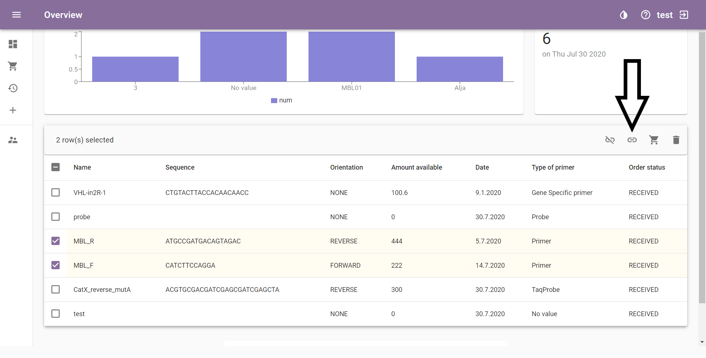
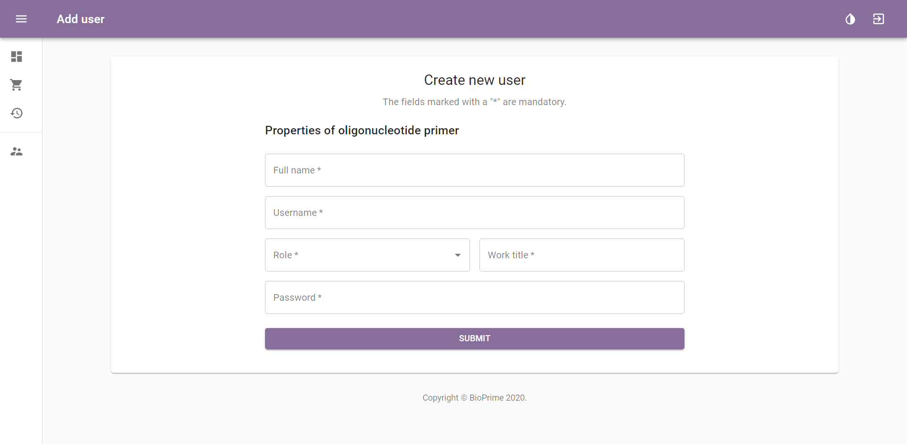

# Specifications of BioPrime

## A Repository for Keeping Record of Primers in a Biobank

### First Introduction

This document was created in the scope of the project “Vzpostavitev informacijskega sistema za vodenje knjižnice oligonukleotidnih začetnikov” as part of the program “Po kreativni poti do znanja” financed by the Ministry of education, science and sport of the Republic of Slovenia and the European Social Fund.

This document describes the specifications of BioPrime, a computerized repository for keeping track of primer data. This is a system for organizing and managing primer data, keeping track of existing stock of primers available in the laboratory and their location of storage. It was designed to simplify the procedure of ordering primers and to keeping record of primer consumption. It also provides a better overview of research and analysis performed in a laboratory and can work as a time-saving tool.

Good documentation constitutes an essential part of the quality assurance system and is crucial for operating in compliance with GMP requirements. This document provides a detailed description of specific functions of the repository, including instructions and procedures written in an instructional form. The document contains:

* review of the repository with a use case diagram
* detailed description of user access control
* functional requirements of individual parts of the repository (system functionality)
* user view, that represents the final appearance of the repository
* a database diagram showing all attributes and how the pages are interconnected

### Review of the Repository

#### Use Case Diagram

### User Access Control

A new user is created by the Administrator, who also provides their username and password, which can be changed if forgotten. New users can also log in with an already existing email. The Administrator sets the user's role and their level of access.

Different users have different roles in the repository, which controls their access to information or modifying of data. The roles in an ascending order of access are:

* Guest / General user
* Student
* Laboratory Technician
* Researcher / Lab Staff
* Administrator

#### Guest / General User

A Guest / General user has access to primer data (view only) and can export data for printing or other use.

#### Student

A Student has access to primer data (view only) and history view. They can export data and modify primer volume or add a comment.

#### Laboratory Technician

A Laboratory Technician has access to primer data (view only) and history view. They are able to import  (but not export), order new / reorder primers and modify primer volume and state (formulation).

#### Researcher / Lab Staff

A Researcher / Lab Staff has access to primer data (view only) and history view. They are able to import and also export data, add or remove primers, modify primer data, volume and state (formulation) and order new / reorder primers.

#### Administrator

The Administrator has access to primer data (view only), history view and user view. They can export and also import data, add or remove primers, modify primer data, volume and state (formulation) and order new primers / reorder primers. They can see the users overview and add or remove users, modify their level of access and change their roles (described in detail in “Adding and Customizing Users” section.

## System Functionality

We divided the system functionality into specific sections:

* Login Page
* Access to Primer Data Library
* Searching Primer Data
* Sorting Primer Data
* Adding New Primers
* Editing Primer Data
* Ordering Primers
* History View
* Adding and Customizing Users

## Login Page

When you access the BioPrime website, the page first offers you the login options. All repository users need to log in before viewing or customizing data.

New users and their assigned roles are created by the Administrator. Users are then notified by e-mail about their access grant, their username and password. Personal or work e-mail can be used as the username and the password can be changed by the users themselves.

If the password has been forgotten, the Administrator can permit the option of creating a new password, change the role of the user or delete and add them with a new e-mail.

## Access to Primer Data Library

After logging in, the user is presented with the Overview page, the main page of the program.

Icons on the left show (in a descending order):

* Overview, the main page showing primer data
* Orders, where recent and pending orders can be viewed
* Favourites, a page for storing the users' favourite primers
* History, which shows a timeline of all changes made by the users (view limited only to specific users, described in the User Access Control section)
* Add primer / probe, a page for adding primers with no obligatory fields

In the top right corner there’s a button for changing the theme, the link to specifications (“?” icon) which can be exported and printed as a .pdf file, and the user’s username next to the logout button.

The Administrator also has access to the "Manage Users" page, where they can add / delete users and change their roles.

The Overview page view shows general analysis data on top of the page, including the occupancy of refrigerators and the total number of primers.

Primers are presented in a list and are automatically sorted by their Generated name in a descending order. This order can be modified based on any trait (such as Sequence, Freezer, User etc.) by clicking on the title of the trait (described in detail in the Sorting Primer Data section).

Only the desired amount of primer data is shown, described in detail in the Searching and Sorting Primer Data section.

To link primers (e. g. forward, reverse and a probe) select the primers by clicking on the checkboxes on the left and then click on the “Link” icon on the right. The same procedure can be done for unlinking primers, by clicking on “Unlink”. The page gets refreshed automatically.

To add a primer to “Favourites”, select the primer by clicking on the checkboxes on the left first, then click on the “Favourites” icon on the right. The primer should appear in the “Favourites” page.

Details of each primer can be viewed by clicking on the bar with the primer.

This way primers can also be modified or deleted, if your assigned role allows you that option. This is described in detail in the "Editing primer data" section.

## Searching Primer Data

Search options include normal and advanced options.
To access the search bar, select the search icon and the bar will appear on the left. When using normal search, the user can search solely based on the gene.

Advanced search can be accessed by clicking on the "Filter Table" button on the top right and checking off the desired criteria.

Search under these traits is available:

* ID of primer
* Generated name of primer
* Organism
* User
* Type of primer
* Project
* Supplier
* Manufacturer
* Location (Freezer)

Here's an example of a specific search, where only 3 primers meet the searching criteria.

## Sorting Primer Data

Primers can be sorted based on certain traits by clicking on the "View columns" button on the top right and checking off the boxes with desired traits, then clicking on the name of the trait on top of each column to sort them based on ascending order and double clicking for the descending order.

When checking off the boxes, the user can also use the option of "select all" to see all the data at the same time.

To export all primer data from the database, click on the download icon. The data is exported in a .csv format. To print everything click on the printer icon.

To export specific primer data, select a primer first, select "Open data" and then click on the download icon. The data is exported in a .csv format.

## Adding New Primers

New primers are added with a click on the Add (+) sign on the left to add one primer / probe with no obligatory information to fill in (“Add one general”) or the Add (+) sign on top right to access all the adding options with some obligatory fields.

The “Add one general” option allows you to add a single primer or probe with all fields optional to fill in.

The “Add primer” option offers you to add one general primer (described in the previous sectin), one or two (forward and reverse) primers at the same time. You also have the option to put in old primers from the existing data base. If you want to upload a file or import data to the database, you can do so by clicking on the "CSV" option and choosing your document to upload.

To see an example of how the data for importing should look, click on Get sample.csv.

When adding a new primer in this way, instead of the “Add one general” way, the user has to put in the obligatory data (tagged with a * symbol) before the system lets you access the next page. This is a summary:

| Required Data | Optional Data |
|-------|-------|
| Name of primer  | NCBI gene ID  |
| Sequence | Human genome build|
| Organism  | Length |
| Gene  | Tm (℃)  |
| Position in the reference | Optimal T of annealing (℃) |
| Formulation | GC (%)  |
| Purification method | Storing T (℃)   |
| Type of primer | Sonda Sequence (for TaqProbe)   |
| Application  | Length of amplicon  |
| 5' modification | Amount available  |
| 3' modification  | Did you check specificity in blast? |
| Location  | Designer |
| Project | User |
|  | Supplier |
|  | Manufacturer |
|  | Date |
|  | Comment |
|  | Analysis |

When putting in data for a pair of primers, common features are put in first and then specific features for each primer (shown in the picture).

When adding a TaqProbe, extra options for putting in data open up:

* Assay ID
* Size
* Sonda Sequence
* Quencher
* Dye

"Sequence" is also not among obligatory data for TaqProbes.

A document can be added as an appendix to the primer data (e.g. the information sheet provided by the manufacturer).

## Editing Primer Data

After accessing primer data by opening the primer details (described in the "Access to Primer Data Library" section), the user can edit data such as amount available, analysis and comment on the right side of the page by clicking on the bar and then clicking "Save".

The users with the assigned role (described in the User Access Control section) can also edit all the other information by clicking on the editor icon and accessing the "Edit primer" page.

This allows the user to edit data or correct any possible mistakes that were made during the process of adding new primers to the repository. This includes basic primer properties, form of ordered primer, location in the laboratory, project information, designer and supplier information (all described in detail in the "Adding New Primers" section).

The “Analysis” field allows the user to link information (e.g. graphs or videos) as a part of the analysis to the primer data.

To delete a primer, select it by checking off the box on the left of its name then click on the “Delete” icon in the top right corner.

Any changes made can be viewed in the "History" section.

## Ordering Primers

### Ordering New Primers

To make a new order, access the "Orders" page (shown below) by clicking on the shopping cart icon.

To order a new primer, the user should click on the Add (+) sign on the top right, and choose between ordering one or two primers.

Similar to the procedure of adding a new primer, the required fields should be filled in.

When ordering two primers simultaneously, common features are required first and then specific for each primer.

### Reordering Primers

To reorder a primer, you can move it directly from the library on the "Overview" page to the “Ordered” section of "Orders" page. On the Overview page select the primer by clicking on the checkbox on the left and then click on the “Move to wanted” shopping cart icon on the right. It should be noted that if less than 10 µL of a primer are available, a new order should be placed immediately.

If a mistake has been made while putting in the data, the system sends you a warning message.

After completing an order, the date of order appears in the primer details to notify other users searching for that primer.

Existing orders can be viewed in the "Orders" page, accessible by clicking on the shopping cart icon on the top left part of the page. Under the “Orders” section is the "Wanted Oligonucleotide Primers" section, where the user can view all the primers pending to be ordered.

Note that before adding a new order, this page should be checked so the orders don't overlap. If the primer has already been ordered, this is also shown under the "Order status" in primer details (described in the "Access to Primer Data Library" section).

If your order can be ordered in a batch with other primers, it can be added as a pending order under the "Wanted". This allows other users to add their wishes and when enough material from the same supplier is under "Wanted", everything can be ordered in a single batch. When an order has been placed, the primers from the "Wanted" section are moved to the "Ordered" section by selecting the primer(s) and clicking "Move to ordered primers" arrow symbol button (shown in the picture).

When an order has arrived, the primer can be moved to the primers repository by clicking the "Move to primers" (arrow symbol) button. Some additional data, that weren't required when placing an order (but are required when adding a new primer) should be filled in at this point, (noted with a *).

After submitting the data, the primer appears in the library on the “Overview” page.

Orders or wanted primers can be edited in the same way as primer data in the library, by clicking on the row with the primer and clicking on the edit icon (follow the instructions in the Editing Primer Data section).

## History View

Users with the right permission can access the history page and view any recent changes made by other users, including adding or editing primer data and adding or customizing users. Any changes in the Orders section can be viewed in the Orders directly.

This is what a history view looks like:

## Adding and Customizing Users

This function is only visible to the Administrator who can add / delete and customize users and their roles. User view is accessed by clicking on the user icon (the bottom option) on the left.

The admin page shows all the users and their roles with a graphic representation on top of the page showing the distribution of users.

To add a new user to the list, click on the Add (+) sign in the top right corner of the list.

When a new user is added, Full name, Username, Role, Work title and Password need to be defined by the admin.

To edit a user, select the user in the checkbox on the left then click on the "Open selected" sign.

The editing user windows opens up and allows the Admin to change the Full name, Username or Role.

In this database diagram we can see how pages are interconnected and which attributes belong to specific entities.

-------------
